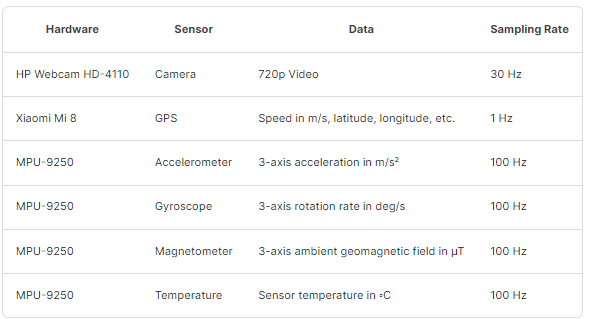
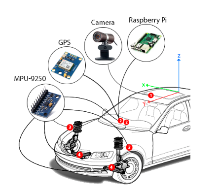
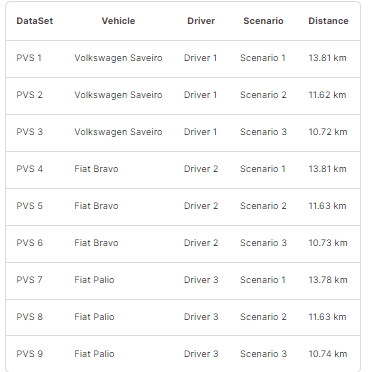
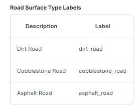
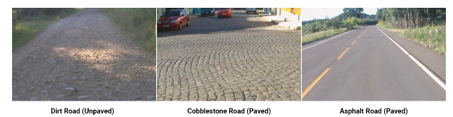
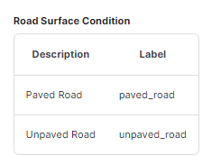
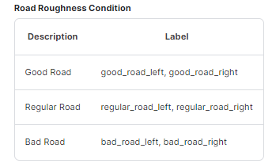
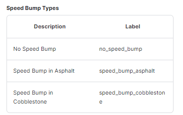
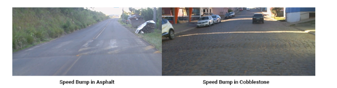

# Problem Statement
Develop solutions for vehicular perception through inertial sensor signals and Artificial Intelligence models. Vehicular perception comprises exteroception and proprioception. Exteroception aims to understand the environment outside the vehicle, recognizing the road features on which it travels. These features include transient events in the form of anomalies and obstacles, such as potholes, cracks, speed bumps, etc.; and persistent events, such as surface type, conservation condition, and the road surface quality. On the other hand, proprioception aims to understand vehicular movements to identify their own behavior. These identifications can also be transient in the form of driving events, such as lane change, braking, skidding, aquaplaning, turning right or left; and persistent, as a safe or dangerous driving behavior profile. This situational information (perceptions) has wide applicability in Intelligent Transport Systems (ITS) such as Advanced Driver Assistance Systems (ADAS) and autonomous vehicles.

Nine datasets using GPS, camera, inertial sensors (accelerometers and gyroscopes), magnetometer, and temperature sensor. These data were produced with contextual variations including three different vehicles, driven by three different drivers, traveling through three different environments. To recognize and classify the vehicular perception pattern

## Hardware Used

All the hardware equipment was attached to the vehicle as shown in the next figure. The camera was placed on the outside car roof (1), and the GPS receiver was placed internally on the dashboard (2). Two networks with MPU-9250 modules were distributed in the vehicle to get data coming from different points. Thus, each end of the front axle (right and left side) received one of the sensor networks, where a module was attached to the control arm (4), located below and near to the vehicle’s suspension system; another module was placed above and near the suspension system, attached to the body immediately above the tire (3); and a third module was attached to the vehicle’s dashboard (2), inside the cabin.

The data were produced in three different vehicles, with three different drivers, in three different environments in which there are three different surface types, in addition to variations in conservation state and presence of obstacles and anomalies, such as speed bumps and potholes. The following table details the data collection contexts.

## DataClass

### Original View of Road  Surface Types

### Road Surface Condition

### Road Roughness Condition

### Speed Bump Types

### Original View of Speed Bump Types

